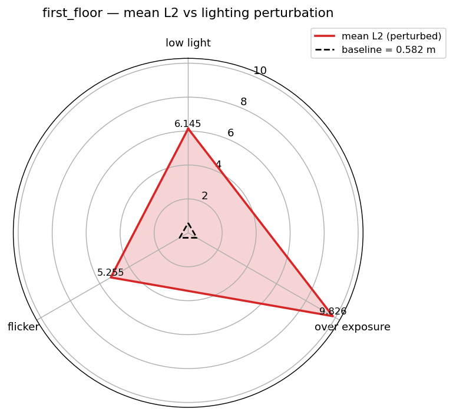
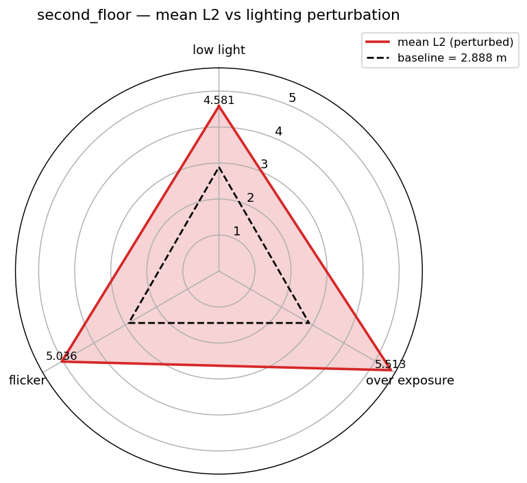

# Homework 1 — Geometry-only ICP SLAM under Environment Uncertainty

You implement a **geometry-only ICP SLAM** pipeline (point-to-plane ICP over
RGB-D frames) and score it by the **mean L2 distance** between your predicted
camera trajectory and the ground truth. The twist: the input data is *not clean*.
Lighting and depth-sensor faults are injected through a single config file, and
part of the grade is how well your algorithm holds up.

- **Simulator:** [Habitat-Sim](https://github.com/facebookresearch/habitat-sim) 0.3.3.
- **Environment:** Replica `apartment_0` (one mesh, two navigable storeys).
- **First floor** — agent spawns at ground level, `start_position: [0.0, 0.0, 0.0]`
  (`y = 0`). This is the *development* environment.
- **Second floor** — agent spawns on the upper storey,
  `start_position: [0.979, 1.425, 3.773]`. This is the *generalization*
  environment. (Note: the intuitive `y = 8` has **no navmesh** in `apartment_0` —
  the mesh's navigable region tops out around `y = 5.4` — so the real upper storey
  at `y ≈ 1.5` is used instead.)
- **Pygame integration:** navigation run in a live pygame window
  (first-person RGB + depth + a top-down bird's-eye panel), so you can *see* every
  frame exactly as it is captured, with all the injected faults already applied.

---

## Quick start

```bash
# 1. Install pixi (task/environment manager) — https://pixi.sh
curl -fsSL https://pixi.sh/install.sh | bash

# 2. Fetch the habitat-lab submodule (an editable dependency)
git submodule update --init dependencies/habitat-lab

# 3. Install the project environment (Python 3.9, habitat-sim, open3d, pygame, …)
pixi install -e habitat
pixi run smoke            # sanity check: prints habitat-sim / habitat-lab versions

# 4. Download the Replica apartment_0 scene into replica_v1/
pixi run fetch-replica
```

Everything below runs inside the pixi `habitat` environment
(`pixi run -e habitat python ...`).

---

# Evaluation dimensions

Your pipeline is scored along two axes, both driven by the same three lighting
perturbations:

1. **Robustness** — stability under perturbation *inside the development
   environment* (first floor).
2. **Generalization** — behaviour *outside* the development configuration: a new
   environment (second floor) under a **shifted, harsher** perturbation
   distribution.

The mechanism: registration is **geometry-only** (no colour), so lighting can
only move the metric through the **depth sensor's ambient-light coupling** —
exposure that is brighter or darker than nominal raises depth noise / dropout and
shrinks usable range (see [Technical details](#technical-details)).

## Robustness (first floor)

Each axis changes **only** the listed `lighting` value(s); everything else stays
at the baseline config.

- **Low light** — `lighting.brightness: 0.3`
- **Over exposure** — `lighting.brightness: 2.5`
- **Flickering** — `lighting.amplitude: 0.8`, `lighting.frequency: 5.0`

Baseline (neutral) is `brightness 1.0`, `amplitude 0.0`.

## Generalization (second floor)

Same three axes, evaluated on the **new** environment with a **shifted
(harsher)** severity distribution — the point is to test the algorithm *off* its
development configuration, not just re-run robustness on another floor:

- **Low light** — `lighting.brightness: 0.2`  (vs 0.3 on the first floor)
- **Over exposure** — `lighting.brightness: 3.0`  (vs 2.5)
- **Flickering** — `lighting.amplitude: 0.9`, `lighting.frequency: 6.0`  (vs 0.8 / 5.0)

A well-generalizing algorithm should degrade *gracefully* here rather than fall
apart, even though it was never tuned for this floor or these severities.

## Radar chart per floor (environment)

`scripts/evaluate.py` renders one radar per floor: three axes (low light, over
exposure, flicker), the series is that floor's mean L2, and the neutral baseline
is drawn as a dashed reference ring. Read it as "how far does each perturbation
push the error away from the clean baseline" — a tight polygon near the baseline
ring is robust; a large polygon is fragile.

Outputs land in `eval/`: `results.csv`, `radar_firstfloor.png`,
`radar_secondfloor.png`.

---

# Implementation — `hw1/` directory structure

## What students submit

1. **`hw1/load.py`** — the simulator launcher / data collector. Builds the
   habitat sim + agent, drives it interactively (pygame keyboard) or replays a
   precomputed trajectory, and writes each capture (`rgb/`, `depth/`,
   `GT_pose.npy`) with the config's faults baked in. You generally do not need to
   change this.
2. **`hw1/utils.py`** — the SLAM library **you implement**: point-cloud
   unprojection, feature/normal preprocessing, ICP (`local_icp_algorithm` and
   your own `my_local_icp_algorithm`), the `reconstruct(...)` loop, and
   `mean_l2(...)`. In this POC it is already fully implemented as a reference so
   the end-to-end idea can be demonstrated.
3. **`hw1/reconstruct.py`** — the runner: reconstructs one floor's capture, prints
   the mean L2, and opens an Open3D window showing the reconstructed cloud with the
   estimated (red) and ground-truth (black) trajectories.

## What graders execute

4. **`scripts/evaluate.py`** — the orchestrator. For each (floor, axis) it replays
   the floor's trajectory through that axis's config into
   `eval/_data/<floor>/<axis>/`, reconstructs it with `hw1/utils.py`, scores the
   mean L2, and emits `results.csv` + the two radar charts:

   ```bash
   pixi run -e habitat python scripts/evaluate.py
   ```

---

# Technical details

## Config-driven simulated environment, rendered through pygame's canvas

Every environment condition — scene, agent actuation, camera intrinsics/
extrinsics, lighting, depth faults, output — lives in one YAML file (see
`configs/*.yaml`); no code edit is needed to retune. Each raw observation is
passed through the config **once** (`process_observations`) so that what you see
in the pygame canvas is *exactly* what gets written to disk: the enabled panels
(first-person RGB, depth, bird's-eye) are composed into a single image and blitted
to the window. Habitat renders offscreen on EGL while pygame owns only the
on-screen CPU blit, so the two OpenGL contexts never collide.

## Photometric simulation

Lighting is emulated as a **post-process on the RGB frame** (the Replica mesh is
flat/vertex-shaded, so in-sim lights largely no-op; a photometric model
demonstrates lighting conditions reliably). The frame is scaled by an exposure
gain with an optional periodic flicker:

```
brightness *= 1 + amplitude * sin(2*pi*frequency*t + phase)
```

plus ambient colour tint, contrast, and gamma. In replay `t` is derived from the
**frame index** (`t = i / fps`), not the wall clock, so flicker is reproducible
across runs and machines given a fixed seed.

## Ambient-light coupling on the depth-sensor emulation

Habitat renders light-independent geometric depth, but a real structured-light /
ToF sensor degrades as scene light drives its emitter SNR down. The depth
emulation couples to the current exposure via `stress = |exposure - light_nominal|`:

```
noise_std    *= 1 + light_noise_gain   * stress
dropout_prob += light_dropout_gain     * stress     (clamped ≤ 1)
max_range    *= 1 - light_range_gain    * stress     (clamped ≥ 0)
```

so brighter- or darker-than-nominal lighting injects more depth noise, more
dropout, and a shorter usable range. This is the *only* path by which lighting
reaches the geometry-only reconstruction — which is exactly what makes the
robustness/generalization metric move. The shared coupling block (identical
across all configs) is:

```yaml
depth:
  noise_std: 0.005          # nonzero base so the light gain has something to scale
  light_nominal: 1.0
  light_noise_gain: 4.0
  light_dropout_gain: 0.3
  light_range_gain: 0.4
```

---

# Appendix — radar charts per floor

One radar per floor: three axes (low light, over exposure, flicker), the red
polygon is that floor's mean L2 under each perturbation, and the dashed ring is
the neutral baseline. First floor is the *robustness* environment; second floor is
the *generalization* environment.

<table>
  <tr>
    <td align="center"><b>First floor</b></td>
    <td align="center"><b>Second floor</b></td>
  </tr>
  <tr>
    <td></td>
    <td></td>
  </tr>
</table>

Underlying numbers (`eval/results.csv`, mean L2 in metres):

| floor        | baseline | low_light | over_exposure | flicker |
|--------------|----------|-----------|---------------|---------|
| first_floor  | 0.58     | 6.15      | 9.83          | 5.26    |
| second_floor | 2.89     | 4.58      | 5.51          | 5.04    |
